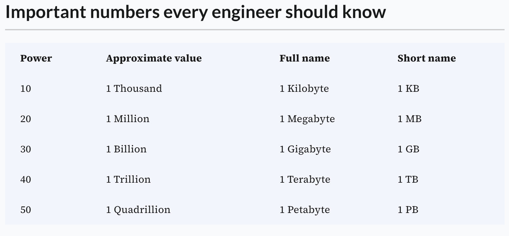
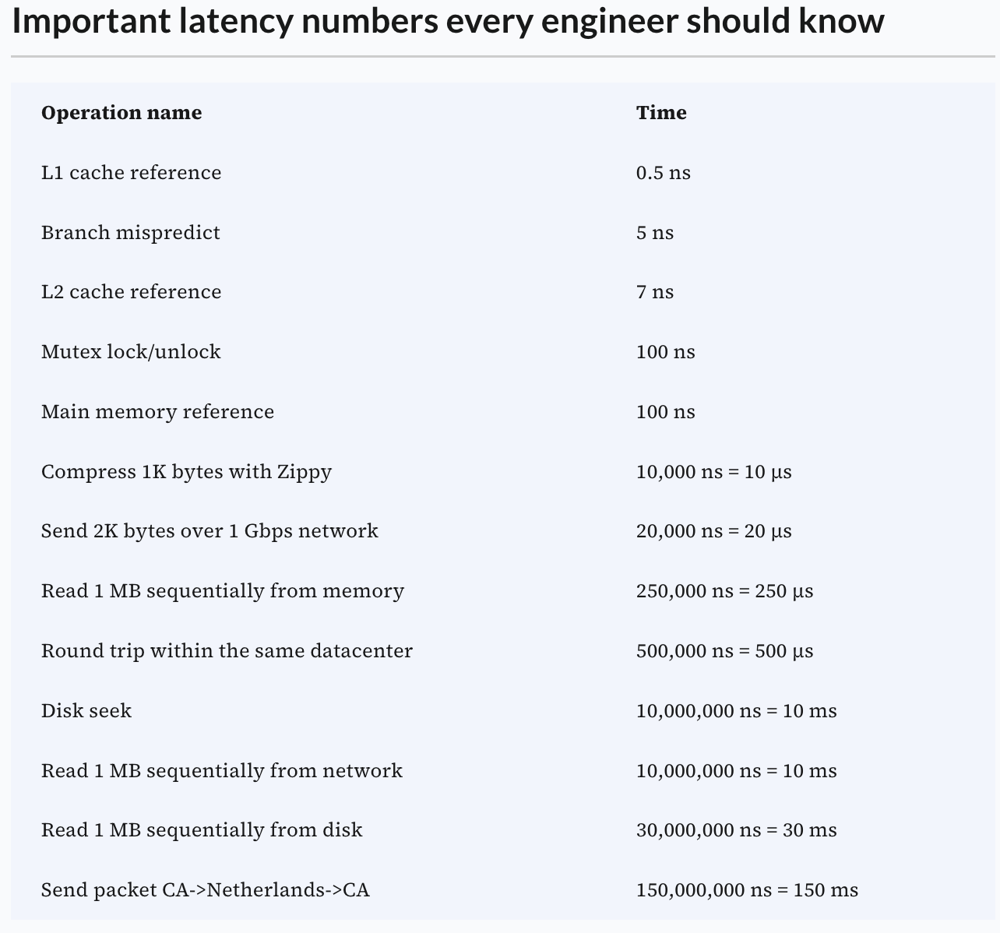

# How to Approach system design interview

## RECAB (pronounce as ricap) -> Requirement, Estimation, Component, Architecture, Bonus

### (R) Requirement - Understanding the problems (5 minutes)

- Functional Requirement
  Mostly would be covered by the interviewer
- Non-Functional Requirement
  - Latency
  - Availability/Consistency tradeoff
  - Number of users
  - Concurrent request
- Out-of-the-scope
  - User Registration/Login
  - SSO
  - SSL/HTTPS
  - Security
  - Spike on load

### (E) Estimation - Capacity estimation and constraints (10-15 minutes)

- Load - Will discus more on it
  - RPS - Request per seconds
  - QPS - query per seconds
- Storage - Will discus more on it
  - If we have 32 GB RAM machine = 100 GB / 32 GB
    - => 4 machines (including 20% overhead due to defragmantation)
    - => Practically, we would be required to keep replica copies
    - => 12 machines (with 3 copies of data)
    - => or 24 machines with 16 GB RAM (lower capacity machines are cheaper)
- Bandwidth - Will discus more on it
  - Incoming data / sec = 2 _ 1000 _ 1000 MB / 0.1 \* 1000,000 seconds (0.1 million seconds a day)
    - = 20 MB/s
    - = 20 MBps
    - = 160 Mbps
  - Some important numbers/points
    "
    - 1000 Byte => 1 KB. 1000 MB => 1 GB.
    - Number of seconds in a day ~0.1 million
    - A century is about 3.14 billion seconds; i.e. Billion seconds = 30 years.
    - 2^32 = 2^2 _ 2^30 = 4 billion = 4 _ 10 ^9
      Represent 4 billion integers = 4*10^9 * 4 = 16 GB
    - Average size of a chat/message/tweet: 100 bytes
    - Java strings are physically stored in UTF-16 encoding which uses 2 bytes to store each char.
    - If CPU is 2.4 ghz then it executes 2.4 billion cycles per second (i.e. 2.4 \* 10^9 cycles) .
      Generally each instruction is associated with certain number of instruction cycles and the clock speed determines the number of instructions that can be executed by the microprocessor in a second.
    - Don't pay too much attention to clock speed; Clock speed is just one aspect of performance. RAM, Graphics card, HDD/SSD, cooling, L1, L2 caches are equally IMPORTANT.
      "

### (C) Component - Bottom up view

- Database
  - Do we need a relational DB or even a NoSQL can do the job? Talk about requirement and then reason it
  - If NoSQL is ok, then what kind of storage? key-value, document, columnar/column
  - Do we need in-memory DB/Cache for low latency read/write
  - Do we need highly available DB? (If yes then NoSQL DBs which favors Availability over Consistency can be used). Good point to bring in the tradeoff of Consistency vs Availability.
  - Is it ok to have eventual consistency? Talk here what does it mean to be eventually consistent or any risk of diverged replicas.
  - If you are asked to achieve strong consistency then discuss about CP system and consensus algorithms.
  - Is there any possibility of reconcilation in case the replicas get diverged?
  - What should be partitioning approach? (Range based, hash based or Consistent hashing based)
  - What should be replication strategy? Sync/Async, master-slave replication, leaderless replication
  - Do we need reliable Persistence or durability? (If yes, then at least write should be acknowledged only if write is complete in file system and not only in cache at least on one node. Even better it should be done at least at 2 nodes.)
  - Good to ask — Consider successful if replicated or stored in file system? - Talk in detail about which DB you are preferring and why? If you suggesting to use Cassandra, talk in detail the reason. And what are the benefits.
- RestAPI Design

### (A) Architecture - Connecting the boxes (10-15 minutes)

- Asynchronous component (like processing image/videos): Use Queue/Streaming platform like Kafka
- Cache / low latency read/write: Use Redis, Couchbase/Memcache
- File Storage or Block Server (for image / video): AWS S3, HDFS
- Highly available and fault tolerant persistence: Cassandra,Dynamo
- Highly consistent storage: Etcd
- Storage which can help in membership management: Zookeeper, Etcd
- Search / Full text search: Elasticsearch / Apache Solr
- Reactive communication between client and server: use WebSocket instead of plain vanilla HTTP
- Load balancers: AWS ALB for achieving high availability and distributing traffic/requests

### (B) Bonus

- Rate Limit
  - DDOS
- SLA/SLO
- Concurrency
  - Pessimistic Locking / Mutual exclusion
  - Optimistic concurrency control
  - Single writer
- Push Notifications
- Data Deduplication
  - Post-process deduplication
  - In-line deduplication
- Operation/deployment

  - CI/CD
  - Traffic switching
  - Schedule/On-demand scaling
  - Dashboard
    - Latency
    - Error
    - Load
  - Incident post mortem
  - Distributed tracing

  ### Important numbers every engineer should know

  

  ### Important latency numbers every engineer should know

  
